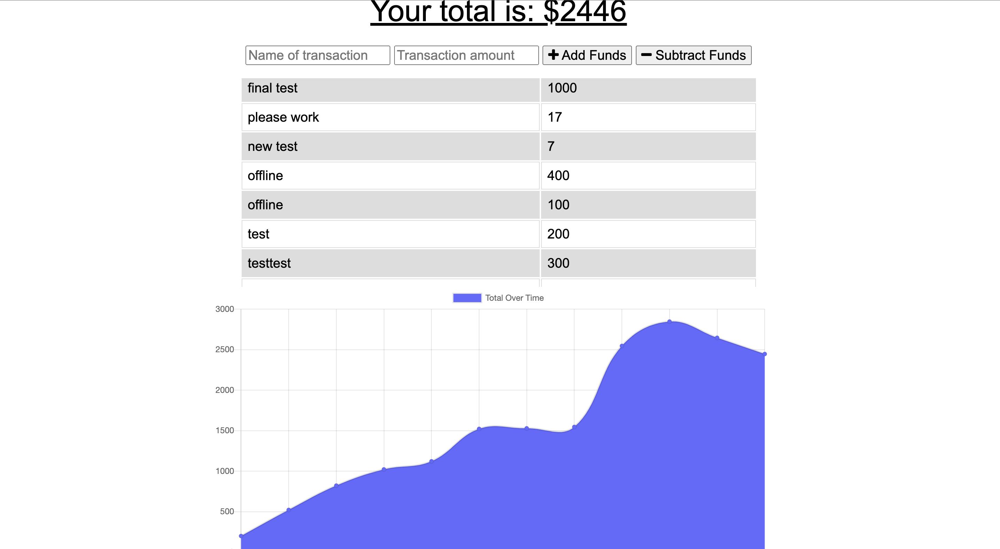
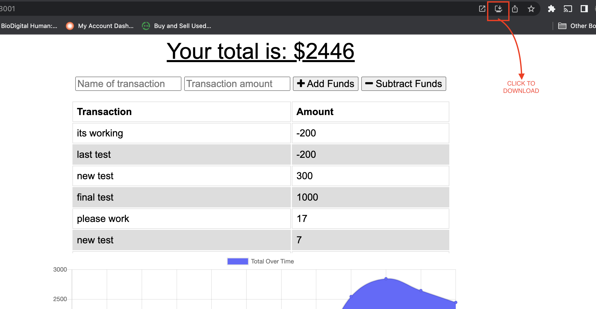

# Budget Tracker PWA Application

 

A Budget Tracker application that allows users to add expenses and deposits to a budget. The application downloadable and will function while user is offline. 

## Table of Contents

* [Installation](#installation)
* [Usage](#usage)
* [Links](#Links)
* [Features](#Features)

## Installation

1. Download or clone repository
2. `npm install` to install the required npm packages to run

## Usage

* Application will be invoked by using the following command:

  `npm start`

* Open your browser and go to
  
  `http://localhost:3001`

* User can add transactions as deposits or expenses by inputting the following:
  1 Name of there transaction
  2 Transactions Amout
  3 For deposits - select 'Add Funds'
  4 For expenses - select 'Subtract Funds'

* All tractions are  reflected in  Tranaction/Amount Table

* Then total funds over time by date are displayed on graph

  

* The app can be used online and offline

* Offline Functionality:
  * Enter deposits offline
  * Enter expenses offline

* When brought back online:
  * Offline entries should be added to tracker

* There is also the option to download the app

## Links

* [Github]()
* [Live Heroku App]()

## Features
* Express
* Node
* MongoDB
* JavaScript
* Mongoose
* Progressive Web Application

